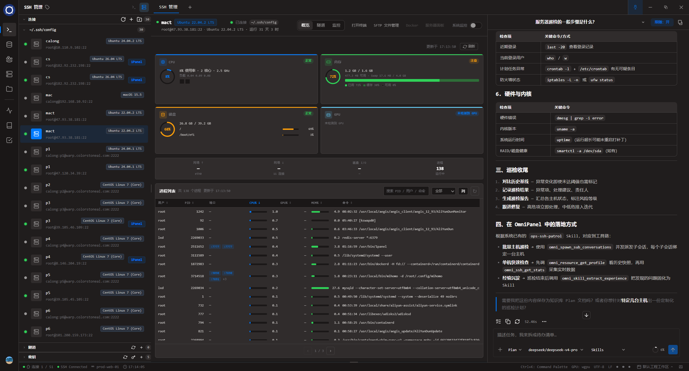
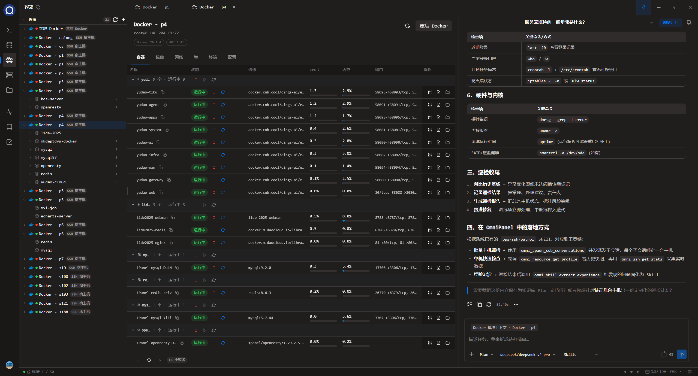
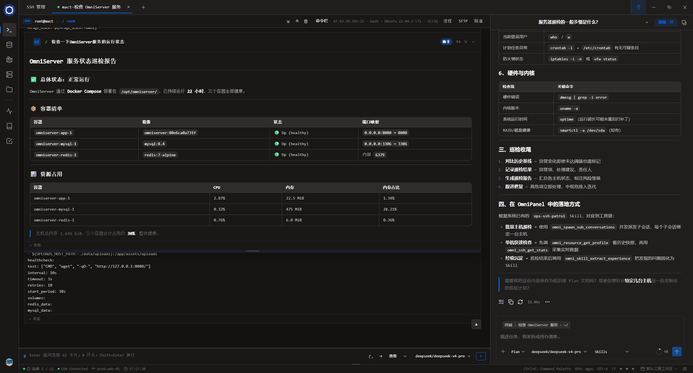

<div align="center">
  <picture>
    <source media="(prefers-color-scheme: dark)" srcset="logo/omni.png">
    
  </picture>
  <h1 align="center">OmniPanel</h1>
  <p align="center">
    AI-Native Cross-Platform Engineering Workstation
  </p>
  <p align="center">
    <a href="./README.zh-CN.md">简体中文</a> ·
    <a href="./README.md">English</a>
  </p>
  <p align="center">
    <a href="https://omniultrax.github.io/omnipanel/"></a>
    <a href="https://github.com/OmniUltraX/omnipanel/pkgs/container/omnipanel-web"></a>
    <a href="https://github.com/OmniUltraX/omnipanel/releases"></a>
    <a href="https://github.com/OmniUltraX/omnipanel/blob/master/LICENSE"></a>
    <a href="https://www.rust-lang.org"></a>
    <a href="https://tauri.app"></a>
  </p>
</div>

---

**OmniPanel** is an AI-native, cross-platform engineering workstation for developers. It unifies terminal, SSH, databases, Docker, server management, files, protocol debugging, and AI assistance in **desktop and Web editions** — eliminating context switching and letting you focus on what matters.

> One window to manage servers, databases, containers, and workflows. One AI that understands your entire engineering context.

**Website:** [https://omniultrax.github.io/omnipanel/](https://omniultrax.github.io/omnipanel/) · **Releases:** [GitHub Releases](https://github.com/OmniUltraX/omnipanel/releases)

### 📸 Screenshots

SSH host overview with live CPU / memory / disk metrics and the built-in AI assistant side by side:



Remote Docker hosts over SSH: container table, resource usage, logs and one-click shell:



AI Agent inspection report — structured health checks grounded in live container and host context:



### ✨ Key Features

| Module | Description |
|--------|-------------|
| **Terminal** | Multi-tab & split panes, Blocks output grouping, VT100/VT220 compatibility |
| **SSH / SFTP** | Connection manager, SFTP, tunnels, jump hosts; **tmux** remote session governance |
| **Files** | Local / remote browsing, favorites, **cross-connection transfer** |
| **Database** | SQL editor, virtual-scroll grid, NL2SQL, schema tools, multi-engine support |
| **Docker** | Local / remote Engine / SSH host / 1Panel / **BT Panel** — containers, images, Compose, networks, volumes |
| **Server** | Host monitor; **BT Panel / 1Panel** (sites, apps, certs, cron); **cloud vendors** |
| **Protocol Lab** | HTTP/API, WebSocket, MQTT, serial — one workspace |
| **AI Assistant** | Context-aware ops, Plans, Skills, `omni_ask_user`, secret redaction, multi-model |
| **Workflow / Tasks** | Templates, runbooks, task center, Quick Launcher, auditable execution |
| **Workspace** | **Custom monitor panels** and pluggable small widgets (host / Docker / MySQL / Redis) |

### Recent highlights (v0.8.x)

| Area | Highlights |
|------|------------|
| **Custom monitor panels** | Drag-and-drop grid panels with host / Docker / MySQL / Redis widgets |
| **Docker · BT Panel** | BT Panel Docker source, SSH one-click import, sidebar folders |
| **Redis** | Visual ops for Streams and richer key preview |
| **Database** | Copyable table identity chip; empty filter clears rows; macOS grid scroll fix |
| **Web edition** | Browser UI + public GHCR image; one-click deploy on Render, Zeabur, Railway, and more |
| **Panel integration** | BT Panel / 1Panel domains (sites·apps·certs·cron); 1Panel v1/v2 compatible |

Full release notes: [CHANGELOG.md](./CHANGELOG.md).

### 🛠️ Tech Stack

```
UI Layer      │  Tauri 2 (React / TypeScript + Rust backend)
Terminal      │  xterm.js (frontend) · portable-pty / ConPTY
SSH           │  russh + russh-sftp
Database      │  sqlx | tiberius | redis-rs | mongodb
Docker        │  bollard
AI            │  rig | async-openai | Ollama | CLI Agent adapter
Storage       │  rusqlite / SQLCipher | keyring-core
```

### 🚀 Getting Started

```bash
# Prerequisites: Rust 1.85+, Node.js 20+
git clone https://github.com/OmniUltraX/omnipanel.git
cd omnipanel

# Frontend deps
cd frontend && npm install && cd ..

# Dev (Tauri + Vite)
cd frontend && npm run tauri dev

# Or frontend only
cd frontend && npm run dev
```

### 🌐 Web edition (P0: frontend / backend split)

Same frontend build and Rust backend — open in the browser (local terminal / SSH / Docker run on the server host):

```bash
# 1. Build web frontend (@tauri-apps/api → HTTP/WS bridge)
cd frontend && OMNIPANEL_WEB=1 npm run build && cd ..

# 2. Start web server (static hosting + /ipc/invoke + WS events)
cargo run -p omnipanel-server -- --static-dir frontend/dist --port 8899

# 3. Open http://127.0.0.1:8899
```

Architecture: business code unchanged; only swap Tauri IPC transport for HTTP + WebSocket:

- `POST /ipc/invoke`: `{ cmd, args }` → command dispatch (equivalent to Tauri `invoke`)
- `WS /ipc/events`: backend event broadcast (equivalent to Tauri `listen`)
- `GET /`: static `frontend/dist`

P0 covers the local terminal path (`create_terminal` / `write_terminal` / `resize_terminal` / `close_terminal` / `terminal_snapshot` / `list_shells`); other modules are wired progressively in `crates/omnipanel-server/src/ipc.rs`. Desktop (`tauri build`) is unaffected.

## Deploy

**Web edition** supports **Docker, Render, Zeabur, Railway, Koyeb, DigitalOcean, and Fly.io**.

**One-click deploy to Render**

[](https://render.com/deploy?repo=https://github.com/OmniUltraX/omnipanel)

**One-click deploy to Zeabur**

[](https://zeabur.com/projects/new?gitRepo=https://github.com/OmniUltraX/omnipanel)

**One-click deploy to Railway**

[](https://railway.app/new/template?template=https://github.com/OmniUltraX/omnipanel)

**One-click deploy to Koyeb**

[](https://app.koyeb.com/deploy?type=docker&image=ghcr.io/omniultrax/omnipanel-web:latest&name=omnipanel-web&ports=8899:http)

**One-click deploy to DigitalOcean**

[](https://cloud.digitalocean.com/apps/new?repo=https://github.com/OmniUltraX/omnipanel/tree/master)

**One-click deploy to Fly.io**

[](https://fly.io/launch?source=github)

> Fly.io: select this repo in Launch (uses `fly.toml` at repo root), or run `fly launch` then `fly deploy` locally.

### Docker

Image: [ghcr.io/omniultrax/omnipanel-web](https://github.com/OmniUltraX/omnipanel/pkgs/container/omnipanel-web) (public — no `docker login`)

```bash
docker run -d --name omnipanel -p 8899:8899 \
  -v omnipanel-data:/data \
  -v /var/run/docker.sock:/var/run/docker.sock \
  -e OMNIPANEL_API_KEY=replace-with-a-long-random-secret \
  ghcr.io/omniultrax/omnipanel-web:latest

# Or: cd deploy/docker && cp .env.example .env && docker compose up -d
```

Open <http://localhost:8899>. If `OMNIPANEL_API_KEY` is unset, the container still starts but logs a security warning (local trial only). See [docs/web/docker.md](./docs/web/docker.md).

### 📁 Project Structure

```
omnipanel/
├── src-tauri/           # Tauri desktop shell (Rust commands, plugins)
├── frontend/            # React / TypeScript UI
├── crates/              # Shared Rust libraries
├── website/             # Product site (GitHub Pages)
├── docs/
│   ├── examples/        # Product screenshots used in README / website
│   └── module-plans/    # Module design notes
├── logo/                # Application icons
└── CHANGELOG.md
```

### 🖥️ Cross-Platform Support

| Platform | PTY Backend | Notes |
|----------|-------------|-------|
| Windows 10+ | ConPTY | Native Windows terminal |
| macOS 12+ | POSIX PTY | Retina display support |
| Linux | POSIX PTY | Wayland & X11 |

### 🤖 Three AI Capability Lines

| Line | Entry | Purpose |
|------|-------|---------|
| **InternalOrchestrator** | Tauri IPC `ai_chat_stream` | Built-in UI: multi-backend, `omni_*` tools, terminal approval |
| **Agent Router** | `http://127.0.0.1:8765/v1/*` | Pure LLM routing (OpenAI-compatible SSE), zero MCP coupling |
| **OmniMCP** | `http://127.0.0.1:12756/mcp` | External agents (Cursor / Claude Code, etc.) |

Details and release notes: [CHANGELOG.md](./CHANGELOG.md).

---

## 📄 License

MIT © 2026 [OmniUltraX](https://github.com/OmniUltraX)

---

<div align="center">
  <p>All in One · Compact · Complete · Excellent · Beautiful</p>
</div>
