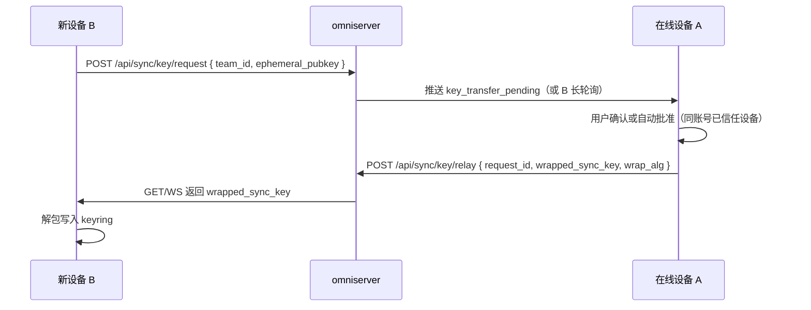

# 同步加密体系重构（客户端 P2P 传钥 + 小程序助手摘要）

状态：设计稿（待实现）  
日期：2026-08-25  
范围：`omnipanel`（桌面/Web）、`omniserver`、`omniminiapp`

## 1. 背景与目标

当前同步加密存在多套并行机制，复杂且职责重叠：

| 机制 | 用途 | 问题 |
|------|------|------|
| `sync_blob_key_material(openid/team)` | OSS 上 modules / conversations 快照 | 非用户可控密钥，协作团队与个人团队双轨 |
| SyncMasterKey + pairing wrap | 新 PC 入网、secrets vault | 依赖 omniserver 配对状态机 + 小程序扫码传钥 |
| `auth_bindings` | 小程序助手身份绑定 | 与传钥、快照解密无关，链路割裂 |

**目标：完全替换上述加密/传钥体系**，改为两条清晰密钥线：

1. **客户端之间**：用户级（按团队）**同步密钥**加密快照上传；新设备经 **服务端中继** 从同账号在线已认证设备获取密钥；无在线设备则 **导入本地 `.key` 文件**。
2. **客户端 ↔ 小程序**：绑定助手时生成 **非对称密钥对**；PC 存公钥并加密 **助手可见摘要** 上传；小程序扫码保存私钥后本地解密展示。**小程序不解 modules 全量快照。**

## 2. 非目标

- 小程序不成为完整 OmniPanel 客户端（不拉取/解密 `modules/latest.json`）。
- 不做局域网 mDNS 发现（首版仅服务端中继；后续可扩展 hybrid）。
- 不与旧版 `SyncMasterKey` / pairing / openid 派生密钥长期并存（允许只读迁移期，见 §8）。

## 3. 密钥模型

### 3.1 同步密钥（Sync Key）

- **生成**：某团队下首台已登录设备本地自动生成 256-bit 随机密钥（`sync_key_v2`）。
- **存储**：本机 keyring / SQLCipher 安全区，按 `(user_id, team_id)` 索引。
- **用途**：加密上传至团队 OSS 的 blob：
  - `modules/latest.json`（连接、数据库、知识库、工作区、侧栏树等）
  - `ai-conversations/latest.json`
- **算法**：沿用 `SyncBlobEnvelope`（Argon2id + AES-256-GCM）；**key_material 改为同步密钥的固定宽度派生输入**（见 §4.1），不再使用 openid / teamOssKey 字符串派生。
- **备份**：设置页可 **导出** `.omnipanel-sync.key`；可 **导入** 恢复。导出文件建议支持可选口令二次加密（Argon2id 包装随机密钥）。
- **展示**：设置页可查看密钥指纹（SHA-256 前 8 字节 hex），**默认不展示完整明文**；高级选项可一次性显示供抄写。

### 3.2 助手密钥对（Assistant Key Pair）

- **生成时机**：PC 绑定小程序助手（`auth_bindings` 流程）时生成 X25519 密钥对 `(sk_a, pk_a)`。
- **PC 侧**：持久化 `pk_a`（及绑定元数据）；上传助手摘要时用 `pk_a` 加密。
- **小程序侧**：绑定二维码携带 **一次性包装后的 `sk_a`**（见 §5.2），扫码后存入 `wx.storage`（建议再经小程序本地口令或设备密钥包装）。
- **用途**：仅加密 **助手可见载荷**（§3.3），不参与 modules / conversations 解密。

### 3.3 助手可见载荷（Assistant Payload）

小程序需要展示、但 **不必** 也不应拉取整包 modules 的数据，例如：

- 设备在线状态、资源摘要（主机/容器/任务）
- 助手聊天 OSS 流中需保密的扩展字段（若现有明文需逐步迁入密文通道）
- 远程命令/通知类结构化摘要
- `ask_user` 等已有 OSS 协议的敏感扩展（按需纳入）

**明确排除：**

- `ClientSyncModulesBundle` 全量内容
- 数据库连接密码、SSH 私钥等（仍走 PC 端 secrets vault + 同步密钥保护的 PC 通道）

上传路径建议：`team_sync/{teamId}/assistant/{deviceId}/latest.json`（或独立 object key 约定），信封字段 `kind: "assistant-payload"`。

## 4. 客户端之间：快照与传钥

### 4.1 快照加密（push / pull）

```
plaintext = JSON(bundle)
key_material = HMAC-SHA256(sync_key, "omnipanel.sync.v2.blob:" + team_id + ":" + kind)
ciphertext = encrypt_sync_blob(key_material, kind, plaintext)  // 现有信封格式
```

- `kind`：`modules` | `ai-conversations`（与现有一致）。
- pull 时：本机无 `sync_key` → 先走 §4.2 获取密钥，再解密；仍失败则提示导入 `.key`。

### 4.2 服务端中继传钥（新设备入网）

**前置**：设备已通过账号登录且 `sync_trusted=true`（沿用设备信任，但不再传 SyncMasterKey）。



- **包装算法**：复用 `x25519-aes256gcm-v1`；AAD 绑定 `request_id:team_id:device_b`。
- **无在线设备**：API 返回 `no_online_peer`；客户端 UI：**「当前无其他在线设备，请导入同步密钥文件」** + 导入入口。
- **无可用密钥且用户取消**：仅可浏览非加密能力或只读云端元数据（若有）；不能 decrypt pull。

### 4.3 废弃能力

删除或停止调用：

- `sync_master_key_*` IPC
- `pairingStart` / `pairingWrap` / `pairingPending` / `authorize` / `redeem` / `pairing-code`
- 小程序「同步安全」扫码批准新 PC
- `sync_blob_key_material` 的 openid/team 派生路径

## 5. 客户端 ↔ 小程序

### 5.1 绑定流程（扩展 `auth_bindings`）

1. PC：`auth_bindings_qrcode` 前生成 `(sk_a, pk_a)`。
2. PC：将 `pk_a` 与 `binding_id` 关联登记到 omniserver（`assistant_pubkey`）。
3. 二维码 payload（v2）：
   ```
   omni://assistant-bind?v=2&bind_id=...&enc_sk=...&wrap_nonce=...
   ```
   其中 `enc_sk` 为使用 **bind 一次性 token**（服务端下发、短 TTL）加密的私钥材料，**禁止明文 sk 入码**。
4. 小程序：扫码 → 调 `confirmBinding` → 解密得 `sk_a` → 本地安全存储。
5. PC：`auth_bindings_wait` 成功后标记该 binding 具备助手解密能力。

### 5.2 助手摘要上传（PC）

- PC 周期性或事件驱动组装 `AssistantPayload` JSON（体积小、字段稳定 schema）。
- `encrypt_assistant_payload(pk_a, payload)` → 上传 OSS。
- 多 binding / 多小程序实例：可按 binding_id 分 object，或 envelope 内带 `key_id`。

### 5.3 小程序拉取与展示

- 登录后按 `oss_path` / team 拉取对应 `assistant/.../latest.json`。
- 本地 `sk_a` 解密 → 渲染设备列表、状态卡片等。
- **不调用** modules pull；不保留 `sync-pairing` 相关 API。

### 5.4 废弃能力

- 小程序 `SyncSecurityPanel` 扫码配对（传同步密钥）
- omniserver `/api/sync/pairing/*` 全套（在客户端升级窗口结束后下线）

## 6. omniserver API 草案

| 方法 | 路径 | 说明 |
|------|------|------|
| POST | `/api/sync/key/request` | 新设备发起传钥请求，带 ephemeral_pubkey、team_id |
| GET | `/api/sync/key/request/{id}` | 查询请求状态 / 取 wrapped_key |
| POST | `/api/sync/key/relay` | 在线设备提交包装后的 sync_key |
| POST | `/api/sync/key/cancel` | 取消请求 |
| GET | `/api/sync/peers/online` | 同账号已认证在线设备列表（供 UI 展示） |
| POST | `/api/bindings/qrcode` | 扩展：登记 assistant_pubkey、返回 bind wrap token |
| GET | `/api/bindings/{id}/assistant-pubkey` | 小程序可选校验用 |

在线判定：沿用现有 presence / 设备心跳；传钥通知可走现有 notify 或 WebSocket。

## 7. 客户端 UI

### 7.1 设置 · 同步与安全

- **同步密钥**：状态（已设置/未设置）、导出 `.key`、导入、指纹
- **在线设备**：列表 + 「从此设备请求同步密钥」
- 移除：SyncMasterKey 生成/备份、配对二维码、动态码

### 7.2 新设备首登

1. 登录成功 → 检测无 sync_key  
2. 自动 `POST /api/sync/key/request`  
3. 有在线 peer → 等待中继（进度提示）  
4. 无 peer → 模态：**导入密钥文件** 或稍后（只读模式）

### 7.3 小程序

- 绑定助手：扫码（含私钥包装）  
- 移除：「同步安全」子页

## 8. 迁移与兼容

| 阶段 | 行为 |
|------|------|
| **读** | pull 时若 envelope 为旧 scheme（`omnipanel-sync-e2e-v1` + 旧 key_material 派生），尝试 legacy 解密；失败则提示升级或导入 |
| **写** | 新版本仅写 `sync_key_v2` 派生信封；push 可双写一段过渡期（可选，默认单写新格式） |
| **下线** | 全量客户端 ≥ 目标版本 30 天后，服务端关闭 pairing API |

secrets vault 仍用设备识别码 / 本地 vault 逻辑；**vault 加密密钥是否改为 sync_key 派生** 单列任务（本设计不强制一期完成，避免范围膨胀）。

## 9. 安全要点

- 同步密钥永不写入 OSS 明文；中继仅传 wrapped 密文。
- 助手私钥仅出现在 **一次性绑定的加密二维码** 中，不落服务端。
- 传钥请求必须校验：同 openid、目标设备已登录、request TTL ≤ 5 分钟。
- 自动批准传钥仅限 `sync_trusted` 且同用户设备；可在设置中关闭自动批准。
- 助手摘要最小化：只含展示所需字段，不含 SSH 密码、私钥、完整连接 config。

## 10. 实现分期

| 阶段 | 交付 |
|------|------|
| **P0** | `sync_key_v2` 生成/导入/导出；快照改新 key_material；omniserver key relay API |
| **P1** | 新设备登录自动要钥 + 无 peer 引导导入；删除旧 pairing UI（桌面） |
| **P2** | 助手绑定密钥对 + 助手摘要加解密 + 小程序解密展示 |
| **P3** | 下线 omniserver pairing；移除 SyncMasterKey / openid 派生；迁移文档 |

## 11. 已确认决策

- [x] 完全替换旧体系（非并行长期共存）
- [x] 传钥走服务端中继（非 LAN）
- [x] 同步密钥首台自动生成，支持 `.key` 导出/导入
- [x] 小程序 **仅** 解密助手可见摘要；**modules 仍只走同步密钥**（PC 之间）

## 12. 测试要点

- 首台生成密钥 → push → 第二台中继收钥 → pull 一致
- 无在线 peer → 导入 `.key` → pull 成功
- 错误密钥导入 → 解密失败可读提示
- 绑定助手 → 小程序解密助手摘要；无 modules 拉取
- 旧版 envelope 只读迁移（若保留 legacy 解密）
